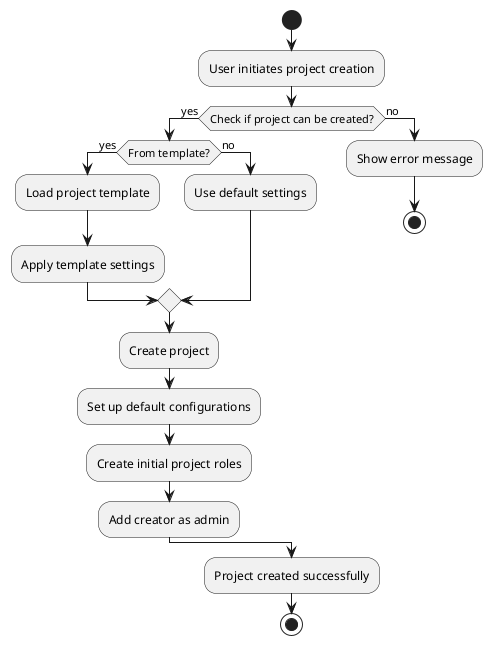
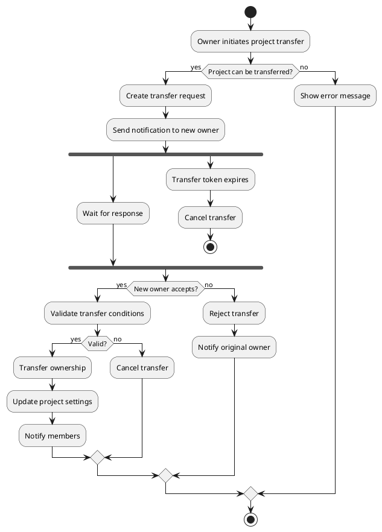
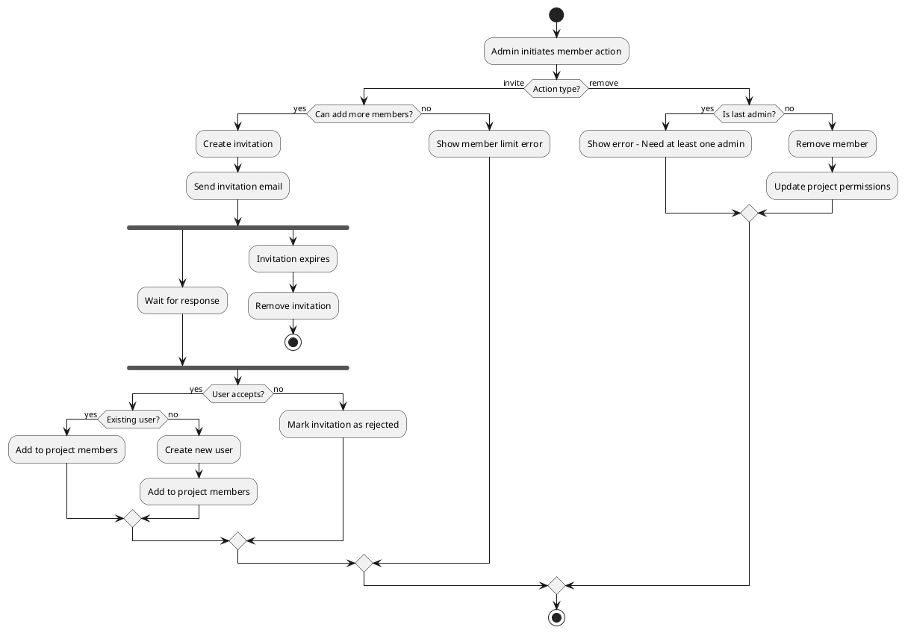
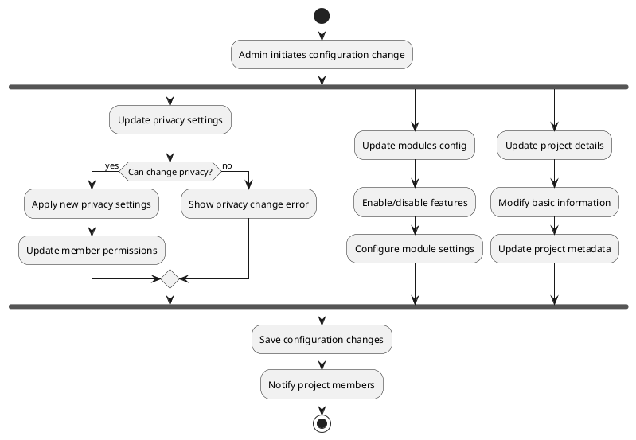
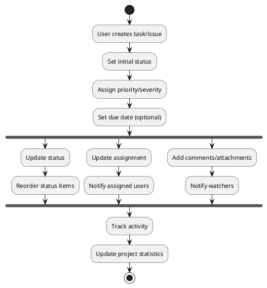

# Activity Diagrams

This document outlines the key workflows in the Taiga backend system using activity diagrams.

## Project Lifecycle Workflow

## Project Transfer Workflow

## Member Management Workflow

## Project Configuration Workflow

## Task/Issue Management Workflow

## Key Points About Workflows

1. **Project Management**
   - Projects can be created from templates or from scratch
   - Ownership can be transferred with proper validation
   - Projects can be duplicated or deleted
   - Privacy settings affect member permissions

2. **Member Management**
   - Supports both direct addition and invitation system
   - Enforces member limits
   - Maintains at least one admin
   - Handles user roles and permissions

3. **Configuration Management**
   - Modular approach to feature enabling/disabling
   - Flexible privacy settings
   - Customizable workflows for different item types
   - Project-specific configurations

4. **Task/Issue Tracking**
   - Customizable workflows
   - Status ordering
   - Assignment and notification system
   - Activity tracking and statistics

5. **Security Considerations**
   - Permission checks at each step
   - Validation of user actions
   - Member limit enforcement
   - Privacy setting restrictions

These workflows demonstrate the complex interactions between different components of the system while maintaining data integrity and user permissions.