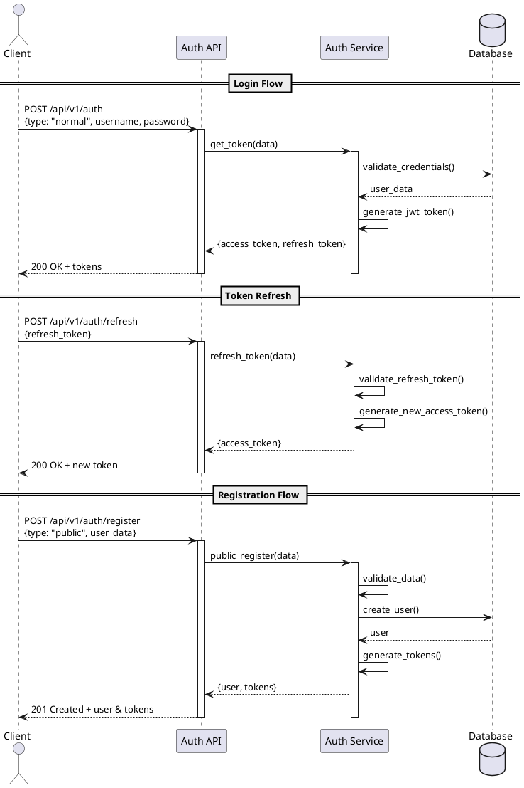
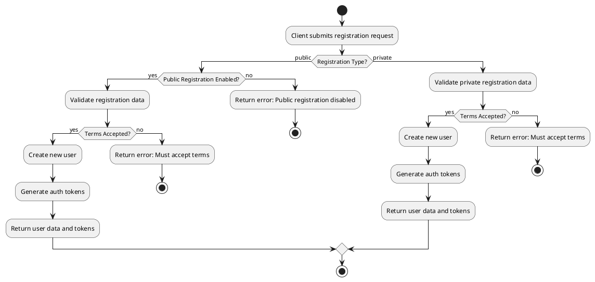

# Authentication System Documentation

## Overview
Taiga implements a token-based authentication system with support for both public and private registration flows. The system uses JWT (JSON Web Tokens) for authentication and includes rate limiting to prevent abuse.

## Authentication Flow Sequence Diagram

## Activity Diagram - Registration Process

## Key Components

### AuthViewSet
Main authentication controller that handles:
- Login (token generation)
- Token refresh
- Token verification (debug only)
- User registration (public and private)

### Rate Limiting
Two types of rate limiting are implemented:
- `LoginFailRateThrottle`: Limits failed login attempts
- `RegisterSuccessRateThrottle`: Limits successful registrations

### Authentication Methods
1. Normal Authentication
   - Username/password based
   - JWT token generation
   - Token refresh capability

2. Plugin-based Authentication
   - Supports multiple authentication backends
   - Configurable through auth plugins system

### Security Features
1. Token-based Authentication
   - Uses JWT tokens
   - Separate access and refresh tokens
   - Configurable token lifetime

2. Rate Limiting
   - Prevents brute force attacks
   - Limits registration spam

3. Terms Acceptance
   - Required for registration
   - Enforced at API level

## API Endpoints

| Endpoint | Method | Description |
|----------|---------|------------|
| `/api/v1/auth` | POST | Login endpoint for token generation |
| `/api/v1/auth/refresh` | POST | Refresh access token |
| `/api/v1/auth/verify` | POST | Verify token (debug only) |
| `/api/v1/auth/register` | POST | User registration endpoint |

## Error Handling

The authentication system handles several types of errors:
- Invalid credentials
- Rate limiting exceeded
- Invalid registration data
- Terms not accepted
- Public registration disabled
- Invalid token
- Token expired

Each error returns appropriate HTTP status codes and detailed error messages.