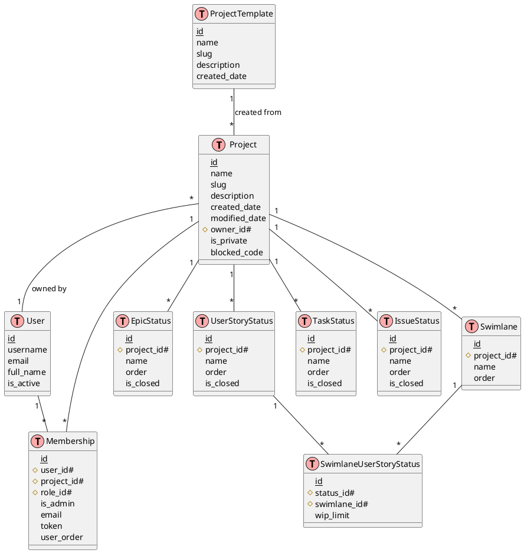

# Entity Relationship Diagram Documentation

## Core Entities and Relationships

## Key Relationships Explained

1. **Project & User**
   - A Project has one owner (User)
   - Users can be members of multiple Projects through Membership
   - Projects can have multiple members through Membership

2. **Project & Membership**
   - One Project can have multiple Memberships
   - Each Membership belongs to one Project
   - Membership represents the relationship between Users and Projects
   - Includes role and admin status information

3. **Project & Status Models**
   - Each Project has its own set of:
     * Epic Statuses
     * User Story Statuses
     * Task Statuses
     * Issue Statuses
   - All status models share common attributes:
     * name
     * order
     * is_closed flag

4. **Project & Swimlanes**
   - Projects can have multiple Swimlanes
   - Swimlanes are connected to User Story Statuses through SwimlaneUserStoryStatus
   - SwimlaneUserStoryStatus allows setting WIP (Work in Progress) limits

5. **Project & Templates**
   - Projects can be created from ProjectTemplates
   - Templates define initial project structure and configurations

## Important Attributes

### Project
- `name`: Project name
- `slug`: URL-friendly identifier
- `description`: Project description
- `is_private`: Privacy flag
- `created_date`: Creation timestamp
- `modified_date`: Last modification timestamp
- `blocked_code`: Project blocking status

### Membership
- `is_admin`: Admin privileges flag
- `email`: For invitation purposes
- `token`: Invitation token
- `user_order`: Order in project member list

### Status Models
All status models (Epic, UserStory, Task, Issue) share:
- `name`: Status name
- `order`: Display order
- `is_closed`: Indicates if this status represents a closed state

### Swimlane
- `name`: Swimlane name
- `order`: Display order
- Connected to statuses with optional WIP limits

## Notes

1. The system uses Django's built-in User model for authentication and user management.
2. Projects can be created either from scratch or from templates.
3. The membership model handles both active members and pending invitations.
4. Status workflows are project-specific, allowing each project to define its own workflow.
5. Swimlanes provide an additional dimension of workflow organization, particularly useful for kanban boards.