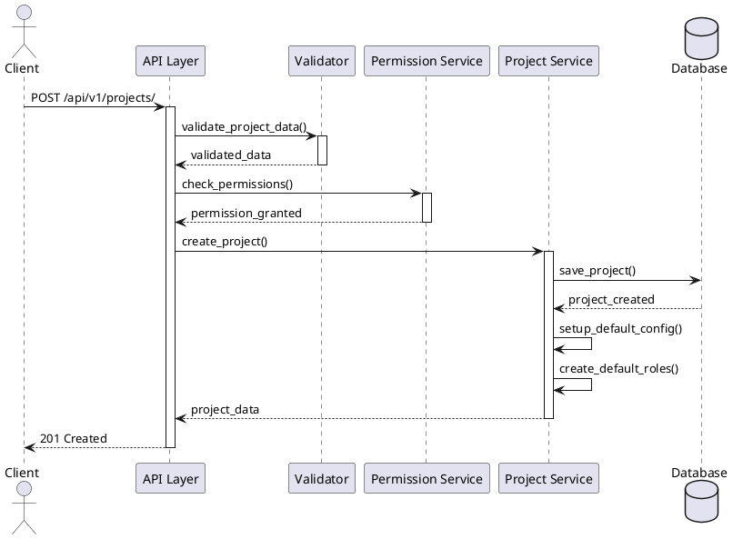
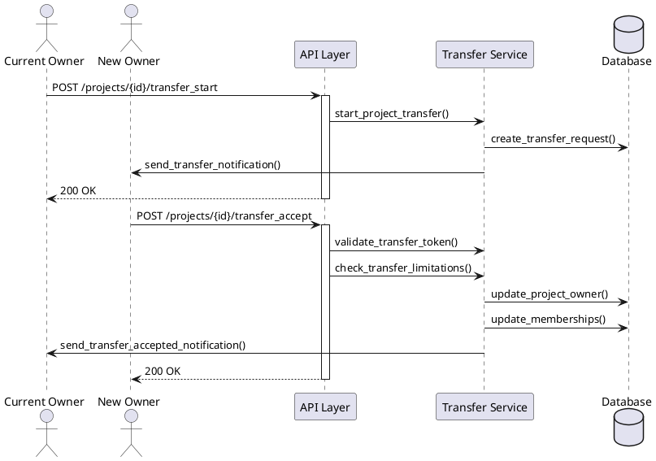
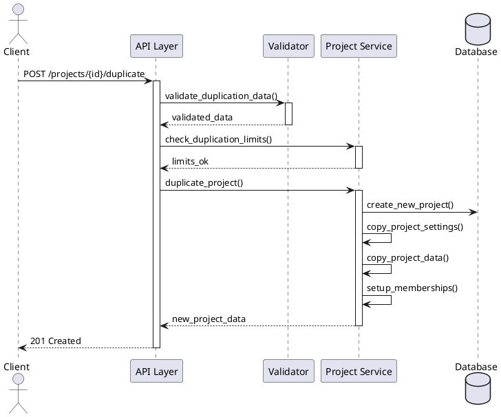
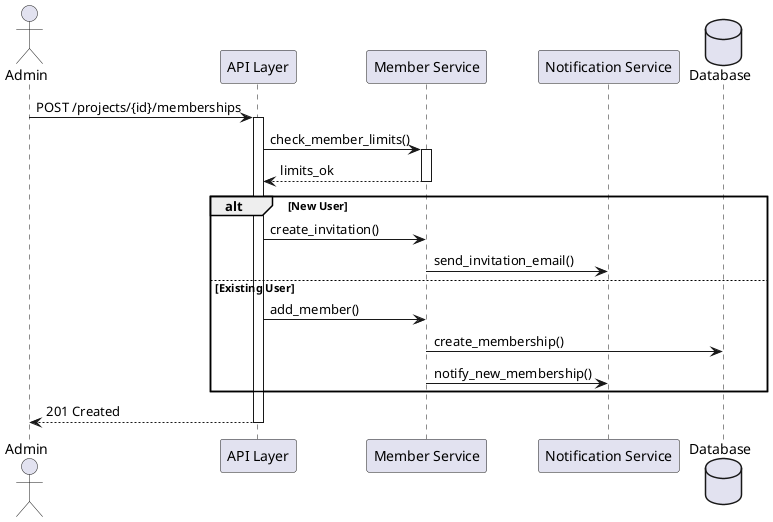
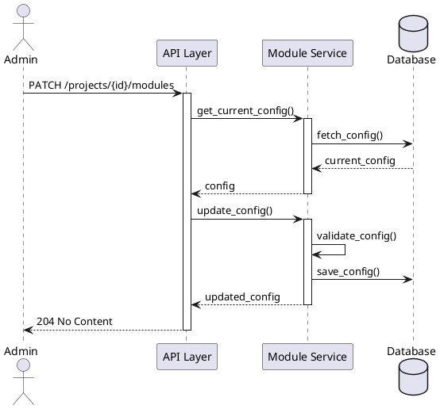

# Sequence Diagrams

This document illustrates the key interactions between different components of the Taiga backend system.

## Project Creation Sequence

## Project Transfer Sequence

## Project Duplication Sequence

## Member Management Sequence

## Module Configuration Sequence

## Key Points About Sequences

1. **Authentication & Authorization**
   - All endpoints require authentication
   - Permission checks are performed before any operation
   - Role-based access control is enforced

2. **Data Validation**
   - Input data is validated before processing
   - Business rules are checked (e.g., member limits)
   - Appropriate error responses are returned

3. **Notifications**
   - System sends notifications for important events
   - Email notifications for invitations
   - In-app notifications for changes

4. **Transaction Management**
   - Complex operations are wrapped in transactions
   - Rollback on failure
   - Data consistency is maintained

5. **Error Handling**
   - Validation errors return 400 Bad Request
   - Permission errors return 403 Forbidden
   - Not found errors return 404 Not Found
   - Server errors return 500 Internal Server Error

These sequence diagrams illustrate the main interactions between different components of the system, showing how data flows and how different services collaborate to accomplish complex tasks.